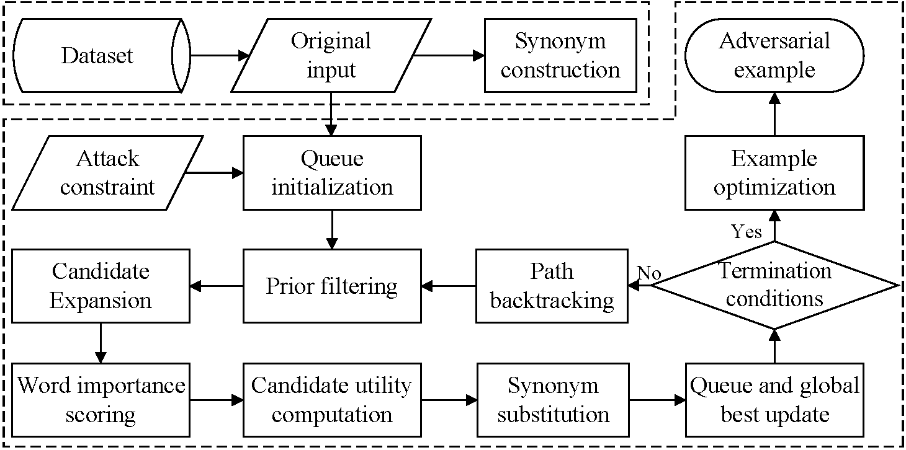

# PCEO

PCEO is an effective and efficient word-level black-box textual adversarial attack method designed to address two major limitations of existing textual adversarial attacks: limited attack success rates and high attack costs.

PCEO incorporates four key components: **Prior Filtering and Dynamic Candidate-Aware Ranking**, **Stagnation-Triggered Candidate Neighborhood Expansion**, **Nearest-Checkpoint Path Backtracking**, and **Success-Preserving Adversarial Example Optimization**. Prior filtering and dynamic candidate-aware ranking reduce unnecessary victim-model queries by prioritizing positions according to word importance, prior information, and candidate utility. Stagnation-triggered candidate neighborhood expansion and nearest-checkpoint path backtracking improve search effectiveness by introducing additional substitution opportunities and revisiting promising alternative search paths when the current search becomes unproductive. After attack success, success-preserving adversarial example optimization further optimizes the successful adversarial example while maintaining attack success.

The name **PCEO** reflects the core design of **P**rior filtering, dynamic **C**andidate-aware ranking, stagnation-triggered candidate neighborhood **E**xpansion, and success-preserving adversarial example **O**ptimization, together with nearest-checkpoint path backtracking.

---

## An Example of Textual Adversarial Vulnerability

Language models can be sensitive to subtle word-level perturbations even when the overall semantics of the input are largely preserved.

The following example illustrates a military intelligence scenario in which a frontline intelligence officer sends a report to a command center. A subtle perturbation to a decision-critical word causes the victim model to misclassify the received intelligence, which may subsequently affect decision support.

<p align="center">
  
</p>

<p align="center">
  <b>Figure 1.</b> Adversarial example in a military intelligence scenario.
</p>

---

## Overview of PCEO

Given an original text $x$, a task-oriented prompt $P$, and a victim model $F$, PCEO forms the complete input $I_0=[P;x]$ and performs a word-level untargeted textual adversarial attack. PCEO searches for an adversarial input $I_{\mathrm{adv}}$ that changes the original model prediction while satisfying predefined semantic, perturbation, and query-budget constraints.

<p align="center">
  
</p>

<p align="center">
  <b>Figure 2.</b> Overall workflow of the PCEO method.
</p>

PCEO first constructs synonym candidates under the predefined attack constraints and initializes a priority queue for best-first search. During iterative search, it filters low-value positions, computes word importance, dynamically evaluates candidate utility, and integrates word importance, prior information, and candidate utility to rank perturbation positions. Following this order, synonym substitution is performed and the priority queue and global best state are updated. When the current search becomes unproductive, PCEO expands the current candidate neighborhood or revisits a promising alternative path from the nearest available checkpoint. After attack success, PCEO further optimizes the successful adversarial example while preserving attack success.

---

## Core Components

PCEO consists of four key components.

### 1. Prior Filtering and Dynamic Candidate-Aware Ranking

Evaluating every modifiable position and its substitution candidates may introduce substantial query overhead. To reduce the query overhead of position selection, PCEO employs a prior-guided dynamic candidate-aware ranking mechanism.

PCEO first filters stopwords, low-value function words, and invalid positions, while assigning higher priorities to task-relevant words. For each retained position $i$, let $W_i$ denote its WIR score, $P_i$ its prior score, and $U_i$ its candidate utility obtained by probing a small number of substitution candidates. The final position score is defined as:

```math
R_i = \lambda_W W_i + \lambda_P P_i + \lambda_U U_i
```

where $\lambda_W$, $\lambda_P$, and $\lambda_U$ control the contributions of word importance, prior information, and candidate utility, respectively. Positions are searched in descending order of $R_i$.

PCEO further performs candidate evaluation dynamically to avoid repeated probing. Candidate utility is evaluated over all retained positions at initialization and after a predefined number of accumulated modifications, while intermediate iterations evaluate candidates only for high-ranked positions. Previously evaluated candidates and responses are cached and reused, reducing unnecessary queries while allowing the ranking to adapt to the current search state.

### 2. Stagnation-Triggered Candidate Neighborhood Expansion

Although the above ranking mechanism prioritizes promising positions, their current substitution candidates may still be ineffective. PCEO therefore introduces a stagnation-triggered candidate neighborhood expansion mechanism.

PCEO uses WordNet to construct candidate sets. A position is regarded as locally stagnant when its current candidate set contains no valid candidate or when none of its current candidates improves the current attack state. Let $\mathcal{C}_i$ denote the current candidate set of word $w_i$, and let

```math
\Delta_i =
\max_{w' \in \mathcal{C}_i}
\left[
S(I_{i \leftarrow w'}) - S(I)
\right]
```

denote the maximum local improvement. The candidate set used for substitution is:

```math
\mathcal{C}_i^{\star} =
\begin{cases}
\mathcal{C}_i,
& \mathcal{C}_i \neq \emptyset \land \Delta_i > 0, \\
\mathrm{Expand}(w_i),
& \mathrm{otherwise}.
\end{cases}
```

where $I_{i \leftarrow w'}$ denotes the state obtained by replacing $w_i$ with $w'$, and $\mathrm{Expand}(w_i)$ expands the candidate neighborhood of the current word.

Unlike uniformly enlarging candidate neighborhoods throughout the search, PCEO activates expansion only when the current candidate neighborhood becomes unproductive. Expanded candidates are evaluated under the same attack constraints, and ineffective expansions are not repeatedly invoked.

### 3. Nearest-Checkpoint Path Backtracking

Candidate neighborhood expansion improves local exploration, but promising alternative states may still be discarded during best-first search. PCEO therefore introduces nearest-checkpoint path backtracking to preserve such alternatives.

Given the current state $I$ and the global best state $I^\star$, the backup set is defined as:

```math
\mathcal{B}_I =
\left\{
I' \in \mathrm{Child}(I)
\mid
S(I') > S(I),
\;
S(I') \leq S(I^\star)
\right\}
```

When backtracking is activated, PCEO selects the highest-scoring unused backup branch from the nearest available checkpoint:

```math
I_{\mathrm{bt}}
=
\underset{I' \in \mathcal{B}_{\mathrm{near}}}{\mathrm{arg\,max}}
\; S(I')
```

where $\mathcal{B}_{\mathrm{near}}$ denotes the unused backup branches stored at the nearest available checkpoint. A checkpoint is created only when $\mathcal{B}_I$ is nonempty.

When the global best remains unchanged for several expansions or the priority queue becomes empty, PCEO activates $I_{\mathrm{bt}}$ and resumes the search from the nearest available checkpoint. The numbers of retained checkpoints and backtracking operations are bounded to avoid excessive exploration and repeated backtracking.

### 4. Success-Preserving Adversarial Example Optimization

After the search obtains a successful adversarial example, redundant substitutions may still remain. PCEO therefore introduces a success-preserving adversarial example optimization mechanism.

PCEO revisits each modified position and first attempts to replace the perturbed word with its original word. This change is accepted only if the resulting example still satisfies the attack success condition.

If replacing the perturbed word with its original word does not preserve attack success, PCEO considers synonyms of the original word and selects a candidate that is lexically closer to it. Let $w_i^0$ and $\tilde{w}_i$ denote the original and currently perturbed words at position $i$, respectively. The optimization candidate is selected as:

```math
\hat{w}_i =
\underset{w \in \mathcal{C}(w_i^0)}{\mathrm{arg\,min}}
\; d_{\mathrm{lev}}(w, w_i^0)
```

where $\mathcal{C}(w_i^0)$ contains synonyms closer to the original word than $\tilde{w}_i$, and $d_{\mathrm{lev}}(\cdot,\cdot)$ denotes the Levenshtein distance.

The candidate is accepted only if attack success is preserved; otherwise, the current substitution remains unchanged. This procedure reduces redundant perturbations and improves the naturalness of successful adversarial examples.

---

## Component Configuration

To make the contribution of each component easy to inspect and reproduce, the PCEO-specific mechanisms in `search_methods/pceo.py` are independently configurable and disabled by default.

With all switches set to `False`, the implementation behaves as a basic WIR-guided best-first search using WordNet substitutions.

```python
from search_methods.pceo import PCEOSearch

search_method = PCEOSearch(
    enable_prior_candidate_aware=False,
    enable_stagnation_expansion=False,
    enable_checkpoint_backtracking=False,
    enable_success_optimization=False,
)
```

The four switches correspond to:

| Switch | Component | Main purpose |
| --- | --- | --- |
| `enable_prior_candidate_aware` | Prior Filtering + Dynamic Candidate-Aware Ranking | Reduce low-value position evaluation and candidate queries |
| `enable_stagnation_expansion` | Stagnation-Triggered Candidate Neighborhood Expansion | Improve local exploration when the current candidate neighborhood becomes ineffective |
| `enable_checkpoint_backtracking` | Nearest-Checkpoint Path Backtracking | Revisit promising alternative search paths |
| `enable_success_optimization` | Success-Preserving Adversarial Example Optimization | Reduce redundant perturbations while preserving attack success |

To run the complete PCEO method:

```python
from search_methods.pceo import PCEOSearch

search_method = PCEOSearch(
    enable_prior_candidate_aware=True,
    enable_stagnation_expansion=True,
    enable_checkpoint_backtracking=True,
    enable_success_optimization=True,
)
```

The switches can also be enabled individually or incrementally to examine the effect of each component.

---

## Datasets

We evaluate PCEO on three widely used sentiment-classification datasets:

- **SST-2**
- **IMDB**
- **MR**

SST-2 and MR mainly contain short movie reviews, whereas IMDB contains relatively long movie reviews.

---

## Victim Models

The experiments consider four victim models:

- **BERT-base-uncased**
- **RoBERTa**
- **Mistral-7B**
- **Phi-4**

This setting covers both conventional pretrained language models and large language models.

---

## Evaluation Metrics

We evaluate attack effectiveness, adversarial-example quality, and attack efficiency using six metrics:

| Metric | Description | Preferred |
| --- | --- | --- |
| **ASR** | Attack Success Rate | Higher |
| **C-rate** | Percentage of modified words in successful adversarial examples | Lower |
| **PPL** | Perplexity of generated adversarial examples | Lower |
| **G-E** | Number of grammatical errors | Lower |
| **Q-N** | Average victim-model queries per successful adversarial example | Lower |
| **T-O** | Average generation time per successful adversarial example | Lower |

Grammatical errors are measured using LanguageTool.

---

## Repository Structure

PCEO is implemented on top of the **TextAttack** framework and follows its modular organization. The main modules relevant to adversarial-example generation include:

```text
PCEO/
├── attack_recipes/        # Attack configurations
├── constraints/           # Linguistic and semantic constraints
├── datasets/              # Dataset interfaces
├── goal_functions/        # Attack success criteria
├── models/                # Victim-model wrappers
├── search_methods/
│   └── pceo.py            # Core PCEO search implementation
├── transformations/       # Text transformations and word substitutions
├── images/                # Figures used in this README
├── LICENSE
└── README.md
```

The most important file for the proposed method is:

- **`search_methods/pceo.py`**: implements the WIR-guided best-first search together with the four configurable PCEO components.

---

## Dependencies

PCEO is developed in a TextAttack-based environment. A compatible environment is:

```text
bert-score>=0.3.5
autocorrect==2.6.1
accelerate==0.25.0
datasets==2.15.0
nltk==3.8.1
openai==1.3.7
sentencepiece==0.1.99
tokenizers==0.15.0
torch==2.1.1
tqdm==4.66.1
transformers==4.38.0
Pillow==10.3.0
transformers_stream_generator==0.0.5
matplotlib==3.8.3
tiktoken==0.6.0
```

The exact dependencies required for a specific experiment may vary with the selected victim model.

---

## Installation

Clone the repository:

```bash
git clone https://github.com/244013fluency-crypto/PCEO.git
cd PCEO
```

Install the local package in editable mode:

```bash
pip install -e . ".[dev]"
```

---

## How to Run

The core search method is implemented in `search_methods/pceo.py`.

For the complete PCEO configuration:

```python
from search_methods.pceo import PCEOSearch

search_method = PCEOSearch(
    enable_prior_candidate_aware=True,
    enable_stagnation_expansion=True,
    enable_checkpoint_backtracking=True,
    enable_success_optimization=True,
)
```

A complete attack experiment should additionally specify:

- the dataset;
- the victim model;
- the transformation method;
- linguistic and semantic constraints; and
- the query budget.

After the final experiment entry script is selected, the corresponding command can be added here, for example:

```bash
python <experiment_script>.py
```

---

## Reproducing Component Effects

The configurable implementation allows users to study the contribution of each mechanism without modifying the search code.

```python
# Basic WIR-guided best-first search
PCEOSearch()

# + Prior filtering and dynamic candidate-aware ranking
PCEOSearch(
    enable_prior_candidate_aware=True,
)

# + Stagnation-triggered candidate neighborhood expansion
PCEOSearch(
    enable_prior_candidate_aware=True,
    enable_stagnation_expansion=True,
)

# + Nearest-checkpoint path backtracking
PCEOSearch(
    enable_prior_candidate_aware=True,
    enable_stagnation_expansion=True,
    enable_checkpoint_backtracking=True,
)

# Full PCEO
PCEOSearch(
    enable_prior_candidate_aware=True,
    enable_stagnation_expansion=True,
    enable_checkpoint_backtracking=True,
    enable_success_optimization=True,
)
```

This interface is intended to make the behavior of each component transparent and facilitate reproducibility and ablation analysis.

---

## License

Please refer to the [LICENSE](LICENSE) file for the terms governing the use of this repository.

---

## Acknowledgement

This project is developed based on the [TextAttack](https://github.com/QData/TextAttack) framework. We sincerely thank the TextAttack authors and contributors for providing an extensible platform for adversarial attacks in NLP.

---

## Contact

For questions regarding the code or experiments, please open an issue in this repository.
